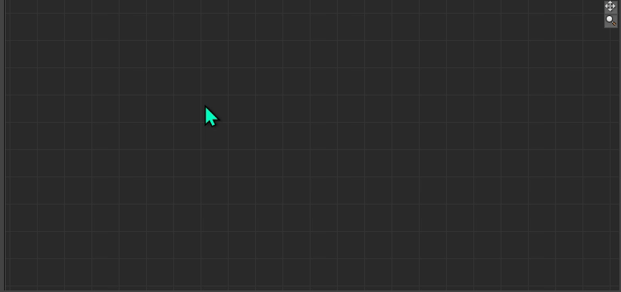
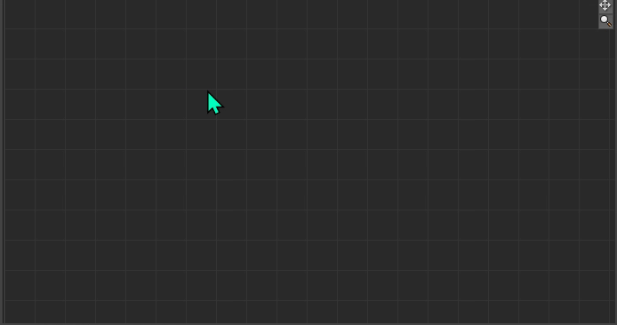
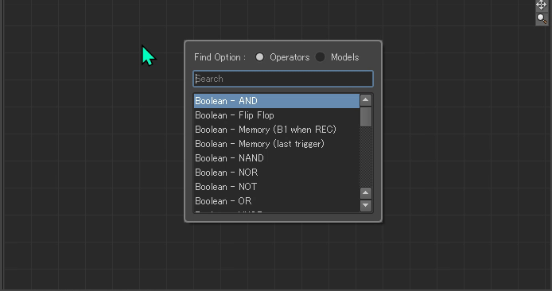
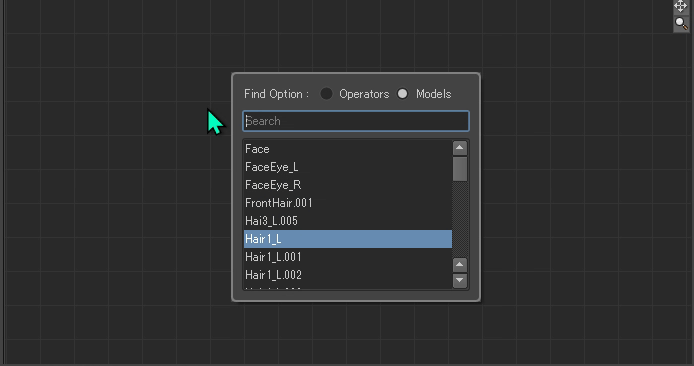
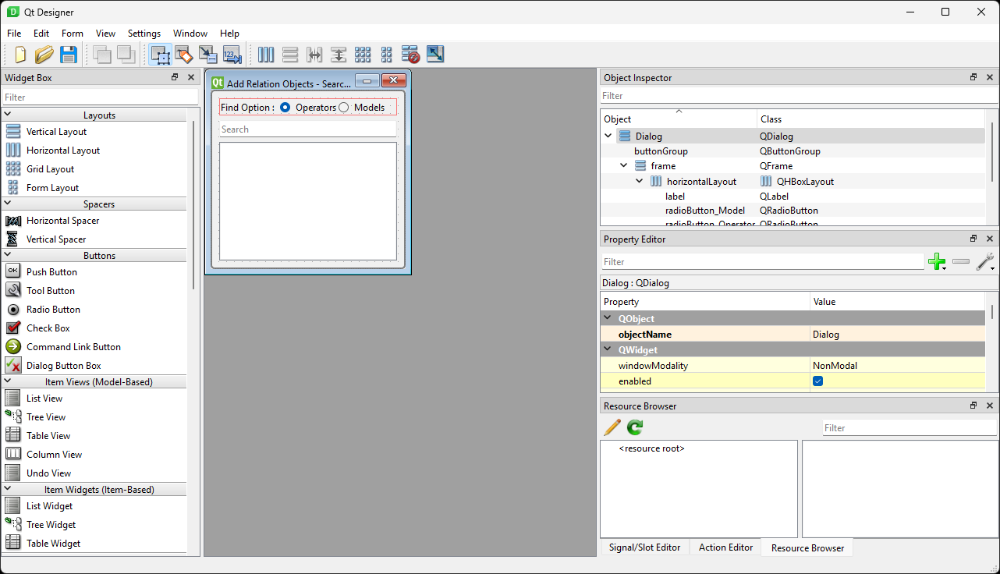

[README - English](/README.md) | [DeepWiki](https://deepwiki.com/Ndgt/Relation-Constraint-Dialog)

# Relation Constraint Dialog
MotionBuilder の Relation Constraint において手軽にオブジェクト配置ができる、検索ダイアログを提供するプラグインです。

<p align = "center">
<br>
</p>

<br>
<br>

## 想定される用途と制限事項
> [!CAUTION]
> このプラグインは、MotionBuilder SDK が正式にサポートしていない内部仕様に基づいて実装されています。MotionBuilder のUIが Qt をベースに作られているらしいことを踏まえ、Qt のライブラリを活用できる範囲で開発していますが、内部仕様は将来的に予告なく変更される可能性があります。ご利用は自己責任でお願いいたします。

このプラグインは、以下のような**本番環境での使用は推奨されません**：

- ライブ演出やリアルタイム操作

代わりに、以下の用途に限定してご利用ください：

- オフライン編集
- 事前セットアップ作業

念のため、**本番環境ではインストールしたプラグインを `plugins`フォルダから除去してください**。


<br>
<br>

## 環境
- **MotionBuilder: 2020 以降**

- **OS: Windows**

    （備考: Linux版のプラグインは現在開発中で、今後のリリースで追加する予定です）

<br>
<br>

## インストール

1. [Releases](https://github.com/Ndgt/Relation-Constraint-Dialog/releases) ページから最新版をダウンロード

2. ダウンロードしたアーカイブを展開

3. 使用している MotionBuilder のバージョンを確認<br>

   （例：MotionBuilder 2026 を使用している場合は `...-MB2026.dll` ）

4. 対応する `.dll` ファイルを既定のプラグインフォルダ（`MotionBuilder <version>/bin/x64/plugins`）にコピー

    （**注意**: `plugins` フォルダへのコピーの際、管理者権限が必要になる場合があります。）

<br>
<br>

## 使い方
- **Tab キー** - 検索ダイアログの表示 / 検索オプションの切り替え

    （**注意**: Relation Constraint が**選択状態**になっていて、かつ Relation Constraint の**ペイン上にカーソルがある**場合に表示されます）

    <p align = "center">
    <br>
    </p>

- **上下 キー** - Operator やモデル、またモデルについての Sender/Receiver の選択

    <p align = "center">
    <br>
    </p>

- **Enter キー / クリック** - Operator やモデルの選択の確定、オブジェクト作成

    <p align = "center">
    <br>
    </p>

- **Esc キー / ダイアログ外部クリック** - オブジェクト作成をせずダイアログを終了

<br>
<br>

## 開発
### 開発環境
1. **Visual Studio Build Tools および "C++ によるデスクトップ開発" ワークロード**

    - MSVC v143 - VS 2022 C++ x64/x86 ビルドツール : MotionBuilder 2024 ~
    - MSVC v142 - VS 2019 C++ x64/x86 ビルドツール : MotionBuilder 2022, 2023
    - MSVC v141 - VS 2017 C++ x64/x86 ビルドツール : MotionBuilder 2020

<br>

2. **Qt - qtbase(必須)**, **qttools**(任意)

    このプラグインは **qtbase**（特に QtCore, QtGui, QtWidgets モジュール） を使用して開発されています。また、[Qt Widgets Designer](https://doc.qt.io/qt-6/qtdesigner-manual.html) によるUI作成のため **qttools** モジュールを利用しています。
    - Qt 6.5.3:  MotionBuilder 2025 ~
    - Qt 5.15.2 : MotionBuilder 2022 ~ 2024
    - Qt 5.12.5 : MotionBuilder 2020

<br>

3. **Perl** (Windows の場合)
    
    Qt のソースの設定の際に必要になる Perl は、以下のコマンドでインストールできます。

    ```cmd
    winget install StrawberryPerl.StrawberryPerl
    ```

<br>

### 推奨ビルド環境

バージョン番号をクリックして、各公式ドキュメントを適宜参照してください。

- Qt ソース

    | Qt バージョン  | Visual Studio バージョン |
    |---------------|-------------------------|
    | Qt [6.5.3](https://doc.qt.io/qt-6.5/supported-platforms.html) | Visual Studio 2019 or 2022| 
    |  Qt [5.15.2](https://doc-snapshots.qt.io/qt5-5.15/supported-platforms.html) | Visual Studio 2019 |
    | Qt [5.12.5](https://wiki.qt.io/Qt_5.12_Tools_and_Versions) | Visual Studio 2017 | 

<br>

- MotionBuilder プラグイン

    | MotionBuilder バージョン | Visual Studio バージョン |
    |-------------------------|-------------------------|
    | [2024](https://help.autodesk.com/view/MOBPRO/2024/ENU/?guid=GUID-0C6F6BA3-E9A2-40D0-87AE-F4F8CF20A66C), [2025](https://help.autodesk.com/view/MOBPRO/2025/ENU/?guid=GUID-0C6F6BA3-E9A2-40D0-87AE-F4F8CF20A66C), [2026](https://help.autodesk.com/view/MOBPRO/2026/ENU/?guid=GUID-0C6F6BA3-E9A2-40D0-87AE-F4F8CF20A66C) | Visual Studio 2022 |
    | [2022](https://help.autodesk.com/view/MOBPRO/2022/ENU/?guid=GUID-0C6F6BA3-E9A2-40D0-87AE-F4F8CF20A66C), [2023](https://help.autodesk.com/view/MOBPRO/2023/ENU/?guid=GUID-0C6F6BA3-E9A2-40D0-87AE-F4F8CF20A66C)| Visual Studio 2019 |
    | [2020](https://help.autodesk.com/view/MOBPRO/2020/ENU/?guid=__files_GUID_0C6F6BA3_E9A2_40D0_87AE_F4F8CF20A66C_htm) | Visual Studio 2017 |

<br>


### Git からの Qt のビルド
1. ターミナルを起動し、Visual Studio のビルド環境を設定 (Windows の場合)

    **`vcvarsall.bat`** を使用してください。デフォルトでは `C:/Program Files (x86)/Microsoft Visual Studio/2022/BuildTools/VC/Auxiliary/Build` にインストールされています。

    ```cmd
    path/to/vcvarsall.bat x64 [-vcvars_ver=<version>]
    ```
    また、VS2019なら `-vcvars_ver=14.29`を、VS2017なら `-vcvars_ver=14.16` オプションを使用します。<br>
    詳細は [Microsoft Document](https://learn.microsoft.com/ja-jp/cpp/build/building-on-the-command-line?view=msvc-170#vcvarsall) をご覧ください。

<br>

2. ソースを取得し、目的のバージョンのタグ（例: `v5.15.2`）に移動

    ```cmd
    git clone https://github.com/qt/qt5.git
    cd qt5
    git checkout v<version>  # <version> を目的のバージョン番号に換えてください
    git submodule update --init --recursive qtbase qttools
    ```

    **注意**: Qt/qt5 リポジトリには「5.12.5」ブランチはありません。

<br>

3. ソースの設定

    ```cmd
    cd ..
    mkdir build
    cd build
    ../qt5/configure.bat -opensource -confirm-license -release -nomake examples -nomake tests
    ```

<br>

4. ビルドおよびインストール

    ```cmd
    nmake
    nmake install
    ```

    Qt 6.5.3 の場合:
    ```cmd
    cmake --build . --parallel
    cmake --install .
    ```

    ビルドされた Qt のソースは、デフォルトで `C:/Qt/Qt-<version>` にインストールされます。

<br>

### UIのカスタマイズ
`src/SearchDialog/SearchDialog.ui` を Qt Widgets Designer で開きます。
```cmd
cd src/SearchDialog
C:/Qt/Qt-<version>/bin/designer.exe SearchDialog.ui
```

<p align = "center">
<br>
</p>
<br>

UIの編集を終えたら、**uic** (User Interface Compiler) を用いて `.ui` ファイルをヘッダファイル `.h` に変換します。

```cmd
C:/Qt/Qt-<version>/bin/uic.exe SearchDialog.ui -o ui_SearchDialog.h
```

> [!Note]
> `AUTOUIC` CMake プロパティにより、ビルド時に `.ui`ファイルのヘッダファイルへの変換が自動で行われるので、この処理は必要ではありません。開発時に統合開発環境における自動補完等の機能を利用されたい場合は実行してください。

<br>

### プラグインのビルド
1. **管理者権限で** ターミナルを起動
    
    Windows の場合、[Git からの Qt のビルド](#git-からの-qt-のビルド) と同様に `vcvarsall.bat` を実行して、Visual Studio のビルド環境を設定してください。

<br>

2. このリポジトリをクローン

    ```cmd
    git clone https://github.com/Ndgt/Relation-Constraint-Dialog.git
    cd Relation-Constraint-Dialog
    ```

<br>

3. 環境に合わせて `CMakeLists.txt` の変数の値を編集

    ```CMake
    # === Environment-specific user configuration ===
    set(PRODUCT_VERSION 2024)
    set(MOBU_ROOT "C:/Program Files/Autodesk/MotionBuilder ${PRODUCT_VERSION}")
    set(CMAKE_PREFIX_PATH "C:/Qt/Qt-5.15.2")
    ```

<br>

4. プラグインのビルド

    ```
    cmake -S . -B build -G "Ninja" -DCMAKE_BUILD_TYPE=Release
    cmake --build build
    ```


    このコマンドにより、ビルドされたプラグインが既定のフォルダ `MotionBuilder <version>/bin/x64/plugins` にコピーされます。

<br>
<br>

## 依存関係

このプロジェクトは Qt フレームワーク（Community Edition）をダイナミックリンクで使用します。プロジェクトにおいて使用している Qt のコンポーネントは、GNU Lesser General Public License バージョン3（LGPLv3）のもとでライセンスされています。


ライセンスドキュメントは、このリポジトリに含めています（`LICENSES/lgpl-3.0.txt`）。公式のライセンス条文は[こちら](https://www.gnu.org/licenses/lgpl-3.0.en.html)で確認できます。

Qt のライセンスに関する詳細は、[Qt Companyのライセンスページ](https://www.qt.io/ja-jp/qt-licensing) をご覧ください。

<br>

## ライセンス

このプロジェクトは BSD 3-Clause License のもとでライセンスされています。詳細は [LICENSE](/LICENSE) ファイルをご覧ください。

このプロジェクト自体はBSDライセンスですが、Qt の使用は LGPLv3 に従います。バイナリの再配布は、両方のライセンスの条項を遵守する必要があります。