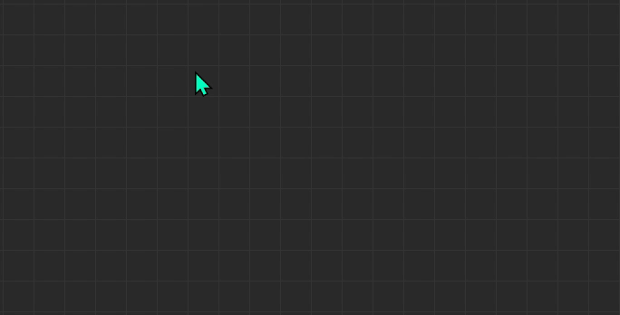
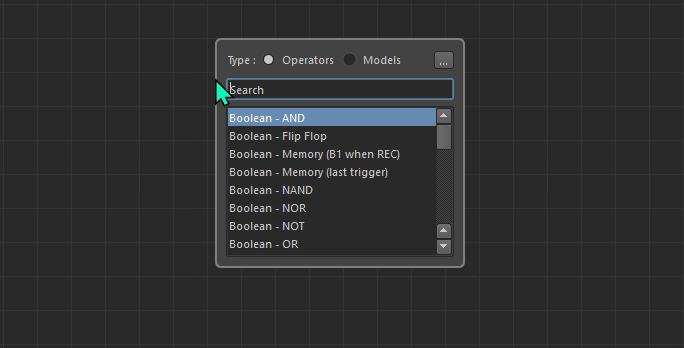
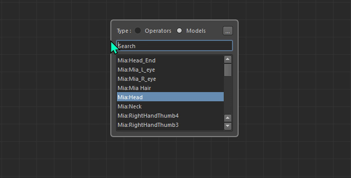
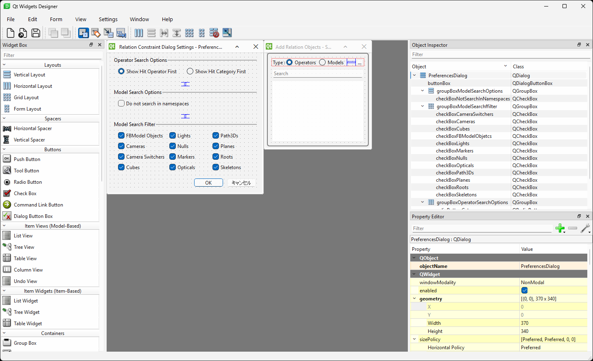

[README - 日本語](/README-jp.md) | [DeepWiki](https://deepwiki.com/Ndgt/Relation-Constraint-Dialog)

# Relation Constraint Dialog

This MotionBuilder plugin provides a convenient search dialog for quickly creating objects in the Relation Constraint.

<p align = "center">
<br>
</p>

<br>

## Platform
- **MotionBuilder: 2022 ~ 2027**

    **Note**: MotionBuilder 2020 is no longer supported since v3.0.

- **OS: Windows**

<br>

## Intended Usage & Limitations
> [!CAUTION]
> This plugin is implemented based on the internal specifications of MotionBuilder, which are not officially supported by the MotionBuilder SDK. It has been developed by leveraging the Qt libraries, based on the assumption that the MotionBuilder UI is built on Qt. However, these internal specifications are subject to change without notice in future updates. Please use this plugin at your own risk.

It is **not recommended** for use in **production environments**, such as:

- Live performances or real-time operation

Instead, please use this plugin only for:

- Offline editing or pre-setup tasks

**For safety, please remove installed plugin from the `plugins` folder in your production environment**.


<br>

## Installation

1. Download the latest release from the [Releases](https://github.com/Ndgt/Relation-Constraint-Dialog/releases) page

2. Extract the downloaded archive

3. Identify the product version of your software

   (e.g., use `...-MB2027.dll` if you're using MotionBuilder 2027)

4. Copy the corresponding `.dll` file and `RelationConstraintDialogConfig.ini` into the default plugin folder:
   `MotionBuilder <version>/bin/x64/plugins`

    (**Note**: You may need administrator privileges to copy files to the `plugins` folder.)

<br>

## Documentation

See the DeepWiki page for detailed documentation: [DeepWiki](https://deepwiki.com/Ndgt/Relation-Constraint-Dialog)

You can build the documentation locally using [Doxygen](https://www.doxygen.nl/) if you have it installed. Run `doxygen <path/to/docs/Doxygen/Doxyfile>`, and refer to the generated `index.html` in the `html` folder.


<br>

## Usage

- **Tab** – Open search dialog / Toggle "Find Option"

    (**Note**: This control only works if **the mouse pointer is hovering over the relation view**.)

    <p align = "center">
    <br>
    </p>

- **Up/Down** – Navigate the suggest list

    <p align = "center">
    <br>
    </p>

- **Enter / Click** – Confirm selection and create object

    <p align = "center">
    <br>
    </p>

- **Esc / Click outside** – Cancel and close dialog

<br>

> [!TIP]
> **Press A while hovering over the relation view** if the relation object is not created at the expected position (at the mouse cursor). <br>
> Since this plugin monitors mouse interaction with the relation view to determine where to create the object, the calculation will result in an incorrect position if the view is "frozen" (i.e., dragged with the mouse but the view was not moved).

<br>

## Development

### Requirements
1. **Visual Studio Build Tools & "Desktop development with C++" workload**

    - MSVC v143 - VS 2022 C++ x64/x86 build tool : MotionBuilder 2024 ~
    - MSVC v142 - VS 2019 C++ x64/x86 build tool : MotionBuilder 2022, 2023

<br>

2. **Qt - qtbase(Required)**, **qttools**(Optional)

    This plugin depends on **qtbase** (specifically QtCore, QtGui, and QtWidgets modules), and utilizes the **qttools** module to design the UI using [Qt Widgets Designer](https://doc.qt.io/qt-6/qtdesigner-manual.html).
    - Qt 6.8.3: MotionBuilder 2027 
    - Qt 6.5.3: MotionBuilder 2025, 2026
    - Qt 5.15.2: MotionBuilder 2022 ~ 2024

    <br>First, create Qt Account on the [Qt Group website](https://www.qt.io/), and download the Qt Maintenance Tool, then install the required Qt components (Open Source version) with the Maintenance Tool. 
    

<br>

3. **vcpkg**

    This project uses vcpkg for project configuration and dependency management. Set up vcpkg with the following command:

    ```
    git clone https://github.com/microsoft/vcpkg.git
    cd vcpkg; .\bootstrap-vcpkg.bat
    ```

<br>

### Recommended Build Configurations

Click version number to see the official resources.

- Qt Source

    | Qt Version  | Visual Studio Version |
    |-------------|-----------------------|
    |  Qt [6.8.3](https://doc.qt.io/qt-6.8/supported-platforms.html) | Visual Studio 2022 |
    | Qt [6.5.3](https://doc.qt.io/qt-6.5/supported-platforms.html) | Visual Studio 2019 or 2022 | 
    |  Qt [5.15.2](https://doc-snapshots.qt.io/qt5-5.15/supported-platforms.html) | Visual Studio 2019 |

<br>

- MotionBuilder Plugin

    | MotionBuilder Version | Visual Studio Version |
    |-----------------------|-----------------------|
    | [2024](https://help.autodesk.com/view/MOBPRO/2024/ENU/?guid=GUID-0C6F6BA3-E9A2-40D0-87AE-F4F8CF20A66C), [2025](https://help.autodesk.com/view/MOBPRO/2025/ENU/?guid=GUID-0C6F6BA3-E9A2-40D0-87AE-F4F8CF20A66C), [2026](https://help.autodesk.com/view/MOBPRO/2026/ENU/?guid=GUID-0C6F6BA3-E9A2-40D0-87AE-F4F8CF20A66C), [2027](https://help.autodesk.com/view/MOBPRO/2027/ENU/?guid=GUID-0C6F6BA3-E9A2-40D0-87AE-F4F8CF20A66C) | Visual Studio 2022 |
    | [2022](https://help.autodesk.com/view/MOBPRO/2022/ENU/?guid=GUID-0C6F6BA3-E9A2-40D0-87AE-F4F8CF20A66C), [2023](https://help.autodesk.com/view/MOBPRO/2023/ENU/?guid=GUID-0C6F6BA3-E9A2-40D0-87AE-F4F8CF20A66C)| Visual Studio 2019 |

<br>

### Customizing UI
You can customize the UI of the search dialog and preferences dialog using the Qt Widgets Designer. Open the `.ui` files with the designer to edit the UI visually.

<br>
<p align = "center">
<br>
</p>
<br>

After you've finished editing the UI, use **uic** (User Interface Compiler) to convert the `.ui` file to the header file `.h`.

```
path/to/Qt/bin/uic.exe SearchDialog.ui -o ui_SearchDialog.h
```

> [!Note]
> This process is not necessary, as the `AUTOUIC` CMake property automatically generates the header files from `.ui` files during the build process. Run this command only if you need it for features like code completion in your IDE.

<br>

### Building Plugin
1. Open the terminal **as an administrator**.


2. Clone this repository.

    ```
    git clone https://github.com/Ndgt/Relation-Constraint-Dialog.git
    cd Relation-Constraint-Dialog/src
    ```

<br>

3. Edit the user-specific variables in [CMakePresets.json](./CMakePresets.json) according to your environment.

    You might need to change the following variables:
    - `generator`: The CMake generator to use
    - `MOBU_ROOT`: The installation path of MotionBuilder
    - `QT_SOURCE_SEARCH_PATH`: The installation path of the Qt source

    <br>

    ```json
    {
      "version": 6,
      "configurePresets": [
        {
          "name": "base",
          "hidden": true,
          "architecture": {
            "strategy": "set",
            "value": "x64"
          },
          "binaryDir": "${sourceDir}/build/${presetName}",
          "generator": "Visual Studio 18 2026",
          "toolset": {
              "strategy": "set"
          },
          "cacheVariables": {
              "CMAKE_AUTOMOC": "ON",
              "CMAKE_AUTOUIC": "ON",
              "CMAKE_CXX_STANDARD": "17",
              "CMAKE_CXX_STANDARD_REQUIRED": "ON",

          ...

      {
        "name": "MotionBuilder2027",
        "inherits": [
          "base"
        ],
        "toolset": {
          "value": "v143"
        },
        "cacheVariables": {
          "MOBU_ROOT": "C:/Program Files/Autodesk/MotionBuilder 2027",
          "PRODUCT_VERSION": "2027",
          "QT_SOURCE_SEARCH_PATH": "C:/Qt/6.8.3/msvc2022_64"
        }
      },
    ```


<br>

4. Build and install plugin

    ```
    cmake --preset MotionBuilder2027 --fresh
    cmake --build --preset 2027-RelWithDebInfo --clean-first
    cmake --install build/MotionBuilder2027 --config RelWithDebInfo
    ```

    <br>The built plugin `.dll` file and `RelationConstraintDialogConfig.ini` file will be copied to the default folder `MotionBuilder <version>/bin/x64/plugins`.

    <br>**Note**: If you are using Visual Studio Code, you can use Tasks to run these commands. See [tasks.json](./.vscode/tasks.json) for reference.

<br>
<br>

## Dependencies

- This project uses the Qt framework (Community Edition) via dynamic linking. 
    
    The Qt components used in this project are licensed under the GNU Lesser General Public License version 3 (LGPLv3). The LGPLv3 license text is included in this repository ([LICENSES/Qt/lgpl-3.0.txt](/LICENSES/Qt/lgpl-3.0.txt)). You can also view the original license text on the GNU website [here](https://www.gnu.org/licenses/lgpl-3.0.en.html).

    For more information about Qt licensing, visit the [Qt Company licensing page](https://www.qt.io/qt-licensing).

<br>

- This project also uses [Microsoft Detours](https://github.com/microsoft/Detours).

     Detours is licensed under the MIT License. The MIT license text is included in this repository ([LICENSES/Detours/LICENSE.txt](/LICENSES/Detours/LICENSE.txt))

<br>

## License

This project is licensed under the BSD 3-Clause License.
See the [LICENSE](/LICENSE) file for full details.

Please note that while this project is BSD-licensed, the use of Qt is subject to LGPLv3 and Microsoft Detours is subject to the MIT License. Redistribution of the binary must comply with the terms of these licenses.