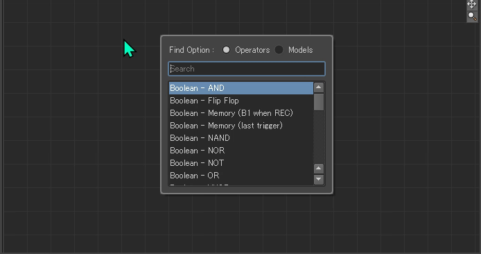
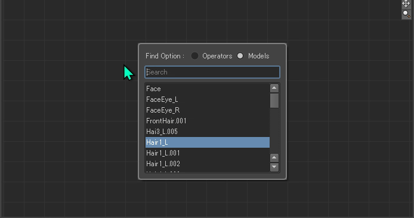

[README - 日本語](/README-jp.md) | [DeepWiki](https://deepwiki.com/Ndgt/Relation-Constraint-Dialog)

# Relation Constraint Dialog

This MotionBuilder plugin provides a convenient search dialog for quickly creating objects in the Relation Constraint.

<p align = "center">
<br>
</p>

<br>


## Platform
- **MotionBuilder :  2020 or above**

- **OS : Windows** 

    (**Note**: Linux support is currently under development and will be added in a future release.)

<br>

## Intended Usage & Limitations
> [!CAUTION]
> This plugin is implemented based on the internal specifications of MotionBuilder, which are not officially supported by the MotionBuilder SDK. It has been developed by leveraging the Qt libraries, based on the assumption that the MotionBuilder UI is built on Qt. However, these internal specifications are subject to change without notice in future updates. Please use this plugin at your own risk.

It is **not recommended** for use in **production environments**, such as:

- Live performances or real-time operation

Instead, please use this plugin only for:

- Offline editing or pre-setup tasks

**For safety, please remove installed plugin from the `plugins` folder in your production environment**.


<br>

## Installation

1. Download the latest release from the [Releases](https://github.com/Ndgt/Relation-Constraint-Dialog/releases) page

2. Extract the downloaded archive

3. Identify the product version of your software

   (e.g., use `...-MB2026.dll` if you're using MotionBuilder 2026)

4. Copy the corresponding `.dll` file into the default plugin folder:
   `MotionBuilder <version>/bin/x64/plugins`

    (**Note**: You may need administrator privileges to copy files to the `plugins` folder.)


<br>

## Usage

- **Tab** – Open search dialog / Toggle "Find Option"

    (**Note**: This control only works if the target Relation Constraint is **selected** in the Navigator, and the **mouse pointer is hovering over** its pane.)

    <p align = "center">
    <br>
    </p>

- **Up/Down** – Navigate the suggest list

    <p align = "center">
    <br>
    </p>

- **Enter / Click** – Confirm selection and create object

    <p align = "center">
    <br>
    </p>

- **Esc / Click outside** – Cancel and close dialog

<br>

## Development

### Requirements
1. **Visual Studio Build Tools & "Desktop development with C++" workload**

    - MSVC v143 - VS 2022 C++ x64/x86 build tool : MotionBuilder 2024 ~
    - MSVC v142 - VS 2019 C++ x64/x86 build tool : MotionBuilder 2022, 2023
    - MSVC v141 - VS 2017 C++ x64/x86 build tool : MotionBuilder 2020

<br>

2. **Qt - qtbase(Required)**, **qttools**(Optional)

    This plugin depends on **qtbase** (specifically QtCore, QtGui, and QtWidgets modules), and utilizes the **qttools** module to design the UI using [Qt Widgets Designer](https://doc.qt.io/qt-6/qtdesigner-manual.html).
    - Qt 6.5.3:  MotionBuilder 2025 ~
    - Qt 5.15.2 : MotionBuilder 2022 ~ 2024
    - Qt 5.12.5 : MotionBuilder 2020

<br>

3. **Perl** (for Windows)
    
    Perl, which is required for configuring the Qt source, can be installed with the following command:

    ```cmd
    winget install StrawberryPerl.StrawberryPerl
    ```

<br>


### Recommended Build Configurations

Click version number to see the official resources.

- Qt Source

    | Qt Version  | Visual Studio Version |
    |-------------|-----------------------|
    | Qt [6.5.3](https://doc.qt.io/qt-6.5/supported-platforms.html) | Visual Studio 2019 or 2022| 
    |  Qt [5.15.2](https://doc-snapshots.qt.io/qt5-5.15/supported-platforms.html) | Visual Studio 2019 |
    | Qt [5.12.5](https://wiki.qt.io/Qt_5.12_Tools_and_Versions) | Visual Studio 2017 | 

<br>

- MotionBuilder Plugin

    | MotionBuilder Version | Visual Studio Version |
    |-----------------------|-----------------------|
    | [2024](https://help.autodesk.com/view/MOBPRO/2024/ENU/?guid=GUID-0C6F6BA3-E9A2-40D0-87AE-F4F8CF20A66C), [2025](https://help.autodesk.com/view/MOBPRO/2025/ENU/?guid=GUID-0C6F6BA3-E9A2-40D0-87AE-F4F8CF20A66C), [2026](https://help.autodesk.com/view/MOBPRO/2026/ENU/?guid=GUID-0C6F6BA3-E9A2-40D0-87AE-F4F8CF20A66C) | Visual Studio 2022 |
    | [2022](https://help.autodesk.com/view/MOBPRO/2022/ENU/?guid=GUID-0C6F6BA3-E9A2-40D0-87AE-F4F8CF20A66C), [2023](https://help.autodesk.com/view/MOBPRO/2023/ENU/?guid=GUID-0C6F6BA3-E9A2-40D0-87AE-F4F8CF20A66C)| Visual Studio 2019 |
    | [2020](https://help.autodesk.com/view/MOBPRO/2020/ENU/?guid=__files_GUID_0C6F6BA3_E9A2_40D0_87AE_F4F8CF20A66C_htm) | Visual Studio 2017 |

<br>

### Building Qt from Git
1. Open a terminal and set the Visual Studio environment variables (for Windows).

    Use **`vcvarsall.bat`**, which is installed by default at  
    `C:/Program Files (x86)/Microsoft Visual Studio/2022/BuildTools/VC/Auxiliary/Build`.

    ```cmd
    path/to/vcvarsall.bat x64 [-vcvars_ver=<version>]
    ```

    Use the option `-vcvars_ver=14.29` for VS2019, or `-vcvars_ver=14.16` for VS2017.  
    See the [Microsoft documentation](https://learn.microsoft.com/en-us/cpp/build/building-on-the-command-line?view=msvc-170#vcvarsall) for more details.


<br>

2. Get Source and checkout to the target tag (e.g. `v5.15.2`)

    ```cmd
    git clone https://github.com/qt/qt5.git
    cd qt5
    git checkout v<version>  # Replace <version> with your target version
    git submodule update --init --recursive qtbase qttools
    ```

    **Note**: There is no "branch" `5.12.5` in the Qt/qt5 repository.

<br>

3. Configure Source

    ```cmd
    cd ..
    mkdir build
    cd build
    ../qt5/configure.bat -opensource -confirm-license -release -nomake examples -nomake tests
    ```

<br>

4. Build and Install

    ```cmd
    nmake
    nmake install
    ```

    In case Qt 6.5.3:
    ```cmd
    cmake --build . --parallel
    cmake --install .
    ```

    By default, the built Qt source will be installed to: `C:/Qt/Qt-<version>` (on Windows)

<br>

### Customizing UI
Open `src/SearchDialog/SearchDialog.ui` with Qt Widgets Designer.

```cmd
cd src/SearchDialog
C:/Qt/Qt-<version>/bin/designer.exe SearchDialog.ui
```

<p align = "center">
<br>
</p>
<br>

After you've finished editing the UI, use **uic** (User Interface Compiler) to convert the `.ui` file to the header file `.h`.

```cmd
C:/Qt/Qt-<version>/bin/uic.exe SearchDialog.ui -o ui_SearchDialog.h
```

> [!Note]
> This process is not necessary, as the `AUTOUIC` CMake property automatically generates the header files from `.ui` files during the build process. Run this command only if you need it for features like code completion in your IDE.

<br>

### Building Plugin
1. Open the terminal **as an administrator**.

    On Windows, refer to [Building Qt from Git](#building-qt-from-git) to run `vcvarsall.bat` and set the Visual Studio environment variables.


<br>

2. Clone this repository

    ```cmd
    git clone https://github.com/Ndgt/Relation-Constraint-Dialog.git
    cd Relation-Constraint-Dialog
    ```

<br>

3. Edit the user-specific variables in `CMakeLists.txt` according to your environment

    ```CMake
    # === Environment-specific user configuration ===
    set(PRODUCT_VERSION 2024)
    set(MOBU_ROOT "C:/Program Files/Autodesk/MotionBuilder ${PRODUCT_VERSION}")
    set(CMAKE_PREFIX_PATH "C:/Qt/Qt-5.15.2")
    ```

<br>

4. Build plugin

    ```
    cmake -S . -B build -G "Ninja" -DCMAKE_BUILD_TYPE=Release
    cmake --build build
    ```

    This command will copy the plugin to the default folder `MotionBuilder <version>/bin/x64/plugins`.

<br>
<br>

## Dependencies

This project uses the Qt framework (Community Edition) via dynamic linking. The Qt components used in this project are licensed under the GNU Lesser General Public License version 3 (LGPLv3).

The LGPLv3 license text is included in this repository (`LICENSES/lgpl-3.0.txt`). You can also view the official license text [here](https://www.gnu.org/licenses/lgpl-3.0.en.html).

For more information about Qt licensing, visit the [Qt Company licensing page](https://www.qt.io/qt-licensing).

<br>

## License

This project is licensed under the BSD 3-Clause License.
See the [LICENSE](/LICENSE) file for full details.

Please note that while this project is BSD-licensed, the use of Qt is subject to LGPLv3. Redistribution of the binary must comply with the terms of both licenses.